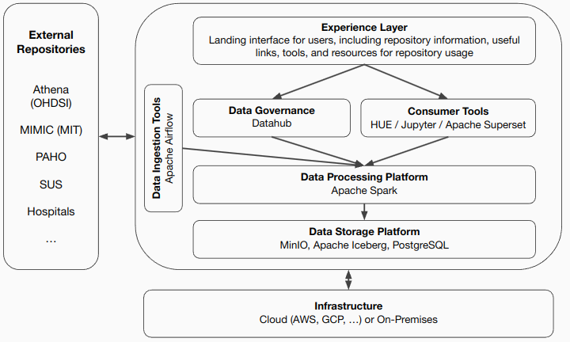

# reBI0S Environment 

This repository contains all the Infrastructure as Code (IaC) scripts responsible for deploying, initializing, and configuring the repository.
Installation instructions are detailed in: [SETUP.md](https://github.com/rebi0s/environment/blob/main/SETUP.md)

# reBI0S Architecture

The rebI0S architecture is based on the state of the practice in Big Data architectures. 

The user begins interacting with the repository from the **Experience Layer**, a landing Web interface that provides repository information and links to tools and resources. The reBI0S architecture provides two primary components for user interaction: 
* **Data Governance**, which manages all metadata and information of associated catalogs and rules for ensuring data quality and access, and
* **Consumer Tools**, which represents a set of tools for end-users to consume the datasets in the repository as query mechanisms, notebooks for scripting, and dashboards.

The first is implemented using the [Datahub](https://datahubproject.io) platform. The second component uses one tool for each purpose: [HUE](https://gethue.com), [Jupyter](https://jupyter.org), and [Apache Superset](https://superset.apache.org).
Both components depend on the **Data Processing Platform**, enabled with the [Apache Spark](https://spark.apache.org) platform. This platform allows the execution of data queries and processing workflows at scale. 
The former component relies on the **Data Storage Platform** to access and process the data. This platform is implemented using a modern, cloud-native stack composed of object storage ([MinIO](https://min.io)), an engine to support seamlessly accessing structured and unstructured data ([Apache Iceberg](https://iceberg.apache.org)), and a relational database ([PostgreSQL](https://www.postgresql.org)) to integrate them. 

To input datasets in the repository in a managed way, the architecture uses the **Data Ingestion** component, which is currently implemented through [Apache Airflow](https://airflow.apache.org) for defining ETLs.

All these tools supporting the implementation of components are open-source to comply with the openness principles of the reBI0S repository. Furthermore, they are all deployed in the **Infrastructure**, a cloud or on-premises infrastructure. To allow such flexibility, all the integration and deployment of these components is automated using [Ansible](https://www.ansible.com), an engine for automation infrastructure as code. 

# Repository Structure

This repository is organized following the structure below:
- hue: contains container definitions for HUE and configuration files to be overwritten.
- iceberg-base: contains container PostgreSQL container definition and configuration for using it as iceberg catalogs.
- minio: contains container definitions for installing MinIO when no S3 storage is available.
- rebios-kubernetes: contains cluster configuration for deploying reBI0S in a k8s cluster.
- spark: contains container definitions for Apache Spark and configuration and startup scripts.
- superset: contains container definitions for Apache Superset and configuration files to be overwritten.

Besides the folders of each component, the root folder contains several scripts (sh) to start and stop each component separately or altogether.

