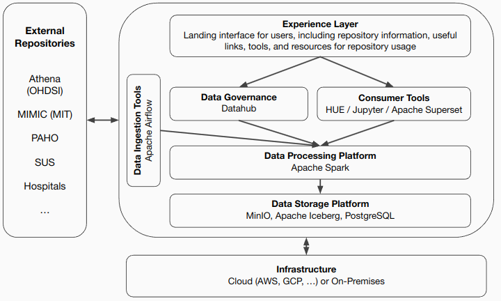
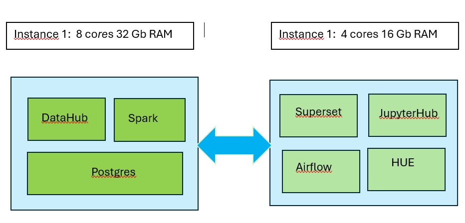

# Configuring Rebios on Kubernetes
This file describes the steps necessary steps to configure the Rebios on Kubernetes using a EC2 instance

# reBI0S Architecture

The rebI0S architecture is based on the state of the practice in Big Data architectures. 

# Install Docker on AWS EC2 instance

## First, update your existing list of packages:
sudo apt update

# Upgrade your system
sudo apt upgrade

## Next, install a few prerequisite packages which let apt use packages over HTTPS:
sudo apt install apt-transport-https ca-certificates curl software-properties-common

## Then add the GPG key for the official Docker repository to your system:
curl -fsSL https://download.docker.com/linux/ubuntu/gpg | sudo apt-key add -

## Add the Docker repository to APT sources:
sudo add-apt-repository "deb [arch=amd64] https://download.docker.com/linux/ubuntu focal stable"

## Make sure you are about to install from the Docker repo instead of the default Ubuntu repo:
apt-cache policy docker-ce

## Finally, install Docker:
sudo apt install docker-ce

## Check that it’s running:
sudo systemctl status docker

## Executing the Docker Command Without Sudo
sudo usermod -aG docker ${USER}

# Install Microk8s on AWS
### install the MicroK8s using the following command
sudo snap install microk8s --classic

### Next, you can check the status of the MicroK8s cluster by running the following command.
sudo microk8s status

### To avoid using microk8s as a prefix while running kubectl commands, you can add an alias of yuor preference if you don’t have an existing installation of kubectl.
### In this installation will be used "kc" as alias using the following command;
alias kc='sudo microk8s kubectl'

### Now, you can execute kubectl commands directly without the prefix.
kc get nodes

### In case you want to use native kubectl for executing the commands, copy the MicroK8s generated kubeconfig to the ~/.kube/config file by using the following command
mkdir ~/.kube
sudo microk8s kubectl config view --raw > ~/.kube/config

### Now, you can use the native kubectl as well to run the commands.
kc get pods -A

### Add user to microk8s group
sudo usermod -a -G microk8s ubuntu
sudo chown -R ubuntu ~/.kube

# AWS Architecture

The rebI0S architecture on AWS is comprised of the following components distributed on two EC2 instances. 

# Deploy Postgres on Kubernetes

### Create namespace
kc delete namespace rebios-postgres 
kc create namespace rebios-postgres 

### Create Config Map
file: postgres-configmap.yaml

apiVersion: v1
kind: ConfigMap
metadata:
  name: postgres-secret
  labels:
    app: postgres
data:
  POSTGRES_DB: postgres
  POSTGRES_USER: postgres
  POSTGRES_PASSWORD: postgres

### Apply Config Map
kc apply -n rebios-postgres -f postgres-configmap.yaml
kc get configmap

### Create Volume
file: pv.yaml

pv.yaml: |
	apiVersion: v1
	kind: PersistentVolume
	metadata:
	  name: postgres-volume
	  labels:
		type: local
		app: postgres
	spec:
	  storageClassName: manual
	  capacity:
		storage: 5Gi
	  accessModes:
		- ReadWriteMany
	  hostPath:
		path: /data/postgresql

### Apply Volume
kc apply -n rebios-postgres -f psql-pv.yaml
kc get pv

### Create Volume Claim
file: psql-claim.yaml

apiVersion: v1
kind: PersistentVolumeClaim
metadata:
  name: postgres-volume-claim
  labels:
    app: postgres
spec:
  storageClassName: manual
  volumeName: postgres-volume
  accessModes:
    - ReadWriteMany
  resources:
    requests:
      storage: 5Gi

### Apply Volume Claim
kc apply -n rebios-postgres -f psql-claim.yaml
kc -n rebios-postgres get pvc

### Create Deployment
file: ps-deployment.yaml

apiVersion: apps/v1
kind: Deployment
metadata:
  name: postgres
spec:
  replicas: 1
  selector:
    matchLabels:
      app: postgres
  template:
    metadata:
      labels:
        app: postgres
    spec:
      containers:
        - name: postgres
          image: 'postgres:15'
          imagePullPolicy: IfNotPresent
          ports:
            - containerPort: 5432
          envFrom:
            - configMapRef:
                name: postgres-secret
          volumeMounts:
            - mountPath: /var/lib/postgresql/data
              name: postgresdata
      volumes:
        - name: postgresdata
          persistentVolumeClaim:
            claimName: postgres-volume-claim

### Apply Deployment
kc apply -n rebios-postgres -f ps-deployment.yaml
kc -n rebios-postgres get deployments

#Check Postgres pods
kc get pods -n rebios-postgres

### Create Service
file: ps-service.yaml

apiVersion: v1
kind: Service
metadata:
  name: postgres
  labels:
    app: postgres
spec:
  type: NodePort
  ports:
    - port: 5432
  selector:
    app: postgres
    

### Apply Service
kc apply -n rebios-postgres -f ps-service.yaml
kc get svc -n rebios-postgres

### Connect to POD
kc get pods -n rebios-postgres
kc exec -n rebios-postgres -it postgres-XXXXXXXXX -- /bin/bash

### Connect to Postgres
psql --user=postgres --port=5432
psql -h localhost -U postgres --password -p 5432 

### Create Database and Users
CREATE DATABASE db_iceberg;
CREATE DATABASE db_hue;
CREATE DATABASE db_superset;
CREATE DATABASE db_datahub;
UPDATE pg_database SET datallowconn = 'true' WHERE datname = 'db_iceberg';
UPDATE pg_database SET datallowconn = 'true' WHERE datname = 'db_hue';
UPDATE pg_database SET datallowconn = 'true' WHERE datname = 'db_superset';
UPDATE pg_database SET datallowconn = 'true' WHERE datname = 'db_datahub';

CREATE ROLE role_iceberg LOGIN PASSWORD 'XXXXXX';
CREATE ROLE role_hue LOGIN PASSWORD 'XXXXXX';
CREATE ROLE role_superset LOGIN PASSWORD 'XXXXX';
CREATE ROLE role_datahub LOGIN PASSWORD 'XXXXX';

GRANT CONNECT ON DATABASE db_iceberg TO role_iceberg;
GRANT CONNECT ON DATABASE db_hue TO role_hue;
GRANT CONNECT ON DATABASE db_datahub TO role_datahub;
GRANT CONNECT ON DATABASE db_superset TO role_superset;

GRANT ALL privileges ON SCHEMA public TO role_hue;
GRANT USAGE, SELECT ON ALL SEQUENCES IN SCHEMA public TO role_hue;

GRANT ALL privileges ON SCHEMA public TO role_iceberg;
GRANT USAGE, SELECT ON ALL SEQUENCES IN SCHEMA public TO role_iceberg;

GRANT ALL privileges ON SCHEMA public TO role_superset;
GRANT USAGE, SELECT ON ALL SEQUENCES IN SCHEMA public TO role_superset;

GRANT ALL privileges ON SCHEMA public TO role_datahub;
GRANT USAGE, SELECT ON ALL SEQUENCES IN SCHEMA public TO role_datahub;

