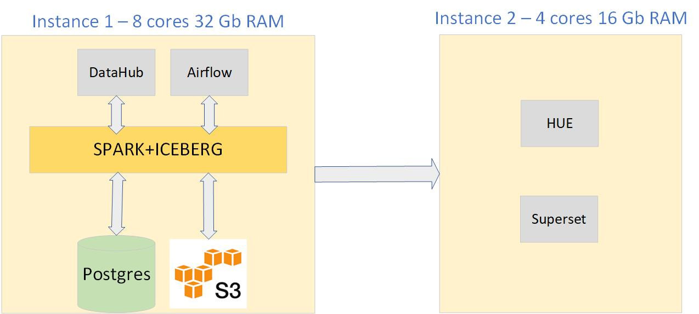

# Configuring Rebios on Kubernetes
This file describes the steps necessary steps to configure the Rebios on Kubernetes using a EC2 instance

# reBI0S Architecture

The rebI0S architecture is based on the state of the practice in Big Data architectures. 


# Install Docker on AWS EC2 instance

## First, update your existing list of packages:
`sudo apt update

# Upgrade your system
```
sudo apt upgrade
```

## Next, install a few prerequisite packages which let apt use packages over HTTPS:
```
sudo apt install apt-transport-https ca-certificates curl software-properties-common
```


## Then add the GPG key for the official Docker repository to your system:
```
curl -fsSL https://download.docker.com/linux/ubuntu/gpg | sudo apt-key add -
```

## Add the Docker repository to APT sources:
``` 
sudo add-apt-repository "deb [arch=amd64] https://download.docker.com/linux/ubuntu focal stable"
```

## Make sure you are about to install from the Docker repo instead of the default Ubuntu repo:
``` 
apt-cache policy docker-ce
```

## Finally, install Docker:
```
sudo apt install docker-ce
```

## Check that it’s running:
```
sudo systemctl status docker
```

## Executing the Docker Command Without Sudo
```
sudo usermod -aG docker ${USER}
```


# Install Microk8s on AWS
### install the MicroK8s using the following command
```
sudo snap install microk8s --classic
```

### Next, you can check the status of the MicroK8s cluster by running the following command.
``` 
sudo microk8s status
```

### To avoid using microk8s as a prefix while running kubectl commands, you can add an alias of yuor preference if you don’t have an existing installation of kubectl.
### In this installation will be used "kc" as alias using the following command;
```
alias kc='sudo microk8s kubectl'
```

### Now, you can execute kubectl commands directly without the prefix.
```
kc get nodes
```

### In case you want to use native kubectl for executing the commands, copy the MicroK8s generated kubeconfig to the ~/.kube/config file by using the following command
```
mkdir ~/.kube
sudo microk8s kubectl config view --raw > ~/.kube/config
```

### Now, you can use the native kubectl as well to run the commands.
```
kc get pods -A
```

### Add user to microk8s group
```
sudo usermod -a -G microk8s ubuntu
sudo chown -R ubuntu ~/.kube
```


# AWS Architecture

The rebI0S architecture on AWS is comprised of the following components distributed on two EC2 instances. 



### Connect to Existing Postgres Installation
```
psql --user=postgres --port=5432
psql -h localhost -U postgres --password -p 5432 
```

### Create Database and Users
```
CREATE DATABASE db_iceberg;
CREATE DATABASE db_hue;
CREATE DATABASE db_superset;
CREATE DATABASE db_datahub;
UPDATE pg_database SET datallowconn = 'true' WHERE datname = 'db_iceberg';
UPDATE pg_database SET datallowconn = 'true' WHERE datname = 'db_hue';
UPDATE pg_database SET datallowconn = 'true' WHERE datname = 'db_superset';
UPDATE pg_database SET datallowconn = 'true' WHERE datname = 'db_datahub';

CREATE ROLE role_iceberg LOGIN PASSWORD 'XXXXXX';
CREATE ROLE role_hue LOGIN PASSWORD 'XXXXXX';
CREATE ROLE role_superset LOGIN PASSWORD 'XXXXX';
CREATE ROLE role_datahub LOGIN PASSWORD 'XXXXX';

GRANT CONNECT ON DATABASE db_iceberg TO role_iceberg;
GRANT CONNECT ON DATABASE db_hue TO role_hue;
GRANT CONNECT ON DATABASE db_datahub TO role_datahub;
GRANT CONNECT ON DATABASE db_superset TO role_superset;


GRANT ALL privileges ON SCHEMA public TO role_hue;
GRANT USAGE, SELECT ON ALL SEQUENCES IN SCHEMA public TO role_hue;

GRANT ALL privileges ON SCHEMA public TO role_iceberg;
GRANT USAGE, SELECT ON ALL SEQUENCES IN SCHEMA public TO role_iceberg;

GRANT ALL privileges ON SCHEMA public TO role_superset;
GRANT USAGE, SELECT ON ALL SEQUENCES IN SCHEMA public TO role_superset;

GRANT ALL privileges ON SCHEMA public TO role_datahub;
GRANT USAGE, SELECT ON ALL SEQUENCES IN SCHEMA public TO role_datahub;
```


# Install Spark

### Create the namespace
```
kc delete namespace rebios-spark
kc create namespace rebios-spark
```


### Create master volume
[spark-pv.yaml](./spark/spark-pv.yaml)

### Apply master volume
```
kc apply -n rebios-spark -f spark-pv.yaml
kc get pv
```

### Create master volume claim
[spark-pvc.yaml](./spark/spark-pvc.yaml)


### Apply master volume claim
```
kc apply -n rebios-spark -f spark-pvc.yaml
kc -n rebios-spark get pvc
```

### Create the master configmap

### Create master volume claim
[spark-master-configmap.yaml](./spark/spark-master-configmap.yaml)


### Apply master configmap
```
kc apply -n rebios-spark -f spark-master-configmap.yaml
kc -n rebios-spark get configmap
```

### Create the master deployment
[spark-master-deployment.yaml](./spark/spark-master-deployment.yaml)


### Apply spark master deployment
```
kc apply -n rebios-spark -f spark-master-deployment.yaml
kc -n rebios-spark get deployments
kc -n rebios-spark get pods
```

### Create the master service

[spark-master-service.yaml](./spark/spark-master-service.yaml)


### Apply spark master service
```
kc create -n rebios-spark -f spark-master-service.yaml 
kc -n rebios-spark get services
```

### Create the worker configmap

[spark-worker-configmap.yaml](./spark/spark-worker-configmap.yaml)


### Apply worker configmap
```
kc apply -n rebios-spark -f spark-worker-configmap.yaml
kc -n rebios-spark get configmap
```

### Create the worker deployment

[spark-worker-deployment.yaml](./spark/spark-worker-deployment.yaml)


### Apply spark worker deployment
```
kc apply -n rebios-spark -f spark-worker-deployment.yaml
kc -n rebios-spark get deployments
kc -n rebios-spark get pods
```

### Create the worker service
[spark-worker-service.yaml](./spark/spark-worker-service.yaml)


### Apply spark service
```
kc apply -n rebios-spark -f spark-worker-service.yaml
kc -n rebios-spark get svc
kc -n rebios-spark get pods
```


# Install Datahub

### Create namespace
```
kc create namespace rebios-datahub
```

### Create secrets
```
kc create secret generic mysql-secrets --from-literal=mysql-root-password=datahub -n rebios-datahub
kc create secret generic neo4j-secrets --from-literal=neo4j-password=datahub  -n rebios-datahub
```

### Create the Pre Requisits
[values-prerequisites.yaml](./datahub/values-prerequisites.yaml)

### Install Pre Requisits
```
helm install -n rebios-datahub prerequisites datahub/datahub-prerequisites --values values-prerequisites.yaml
```

### Check Prerequisits 
```
kc -n rebios-datahub get pods 

NAME                           READY   STATUS    RESTARTS   AGE
elasticsearch-master-0         1/1     Running   0          94s
prerequisites-kafka-broker-0   1/1     Running   0          94s
prerequisites-neo4j-0          1/1     Running   0          94s
prerequisites-zookeeper-0      1/1     Running   0          94s

```

### Install Datahub 
```

helm install datahub datahub/datahub -n rebios-datahub


kc -n rebios-datahub get pods 

NAME                                             READY   STATUS      RESTARTS   AGE
datahub-acryl-datahub-actions-6d7dc8b789-w9f6g   1/1     Running     0          28m
datahub-datahub-frontend-54fbc97fb-4zzsk         1/1     Running     0          28m
datahub-datahub-gms-6cf6cf44d7-zhlkl             1/1     Running     0          28m
datahub-elasticsearch-setup-job-txsln            0/1     Completed   0          35m
datahub-kafka-setup-job-l9jwf                    0/1     Completed   0          35m
datahub-mysql-setup-job-whzq5                    0/1     Completed   0          32m
datahub-nocode-migration-job-nhkm8               0/1     Completed   0          28m
datahub-system-update-hbgzd                      0/1     Completed   0          31m
datahub-system-update-nonblk-xprps               0/1     Completed   0          25m
elasticsearch-master-0                           1/1     Running     0          38m
prerequisites-kafka-broker-0                     1/1     Running     0          38m
prerequisites-mysql-0                            1/1     Running     0          38m
prerequisites-zookeeper-0                        1/1     Running     0          38m

```


# Install Superset

### Create Namespace
```
kc create namespace rebios-superset
```

### Create the volumes 
[pv.yaml](./superset/pv.yaml)
[pv-redis.yaml](./superset/ pv-redis.yaml)


### Apply the Volumes
```
kc apply -n rebios-superset -f pv.yaml
kc apply -n rebios-superset -f pv-redis.yaml
kc -n rebios-superset get pv
```

### Create the volume claims 
[pvc.yaml](./superset/pvc.yaml)
[pvc-redis.yaml](./superset/pvc-redis.yaml)


### Apply the Volume Claims
```
kc apply -n rebios-superset -f pvc.yaml
kc apply -n rebios-superset -f pvc-redis.yaml
kc -n rebios-superset get pvc
```

### Create the volume claims 
[configmap.yaml](./superset/configmap.yaml)


### Apply the Confimap
```
kc apply -n rebios-superset -f configmap.yaml
kc -n rebios-superset get configmaps
```

### Create the Scripts
[scripts.yaml](./superset/scripts.yaml)


### Apply the Scripts
```
kc apply -n rebios-superset -f scripts.yaml
```

### Create the Bash
[bash.yaml](./superset/bash.yaml)

### Apply the Bash
```
kc apply -n rebios-superset -f bash.yaml
```

### Create the Redis
[redis.yaml](./superset/redis.yaml)

### Apply the Redis
```
kc apply -n rebios-superset -f redis.yaml
```

### Create the Service Redis
[service-redis.yaml](./superset/service-redis.yaml)


### Apply the Redis
```
kc apply -n rebios-superset -f service-redis.yaml
```


### Create the Beat
[superset-beat.yaml](./superset/superset-beat.yaml)


### Apply the Beat
```
kc apply -n rebios-superset -f superset-beat.yaml
```

### Create the Beat
[superset-worker.yaml](./superset/superset-worker.yaml)

### Apply the Beat
```
kc apply -n rebios-superset -f superset-worker.yaml
```

### Create the Superset
[superset.yaml](./superset/superset.yaml)

### Apply the Superset 
```
kc apply -n rebios-superset -f superset.yaml
kc -n rebios-superset get pods
```

### Create the Service Superset
[service-superset.yaml](./superset/service-superset.yaml)


### Apply the Superset 
```
kc apply -n rebios-superset -f service-superset.yaml
```

### Check Superset Pods
```
kc -n rebios-superset get pods
NAME                               READY   STATUS    RESTARTS   AGE
superset-7db76db494-6pwj2          1/1     Running   0          5d5h
superset-bash-55866bf6b9-8mtrz     1/1     Running   0          5d6h
superset-beat-ff5c8bcd8-r7x4p      1/1     Running   0          5d6h
superset-redis-0                   1/1     Running   0          144m
superset-worker-84bf5fb848-dsfs7   1/1     Running   0          5d5h
```


# Install Airflow

### Create namespace
```
kc create namespace rebios-airflow
```

### Install Airflow
```
helm repo add apache-airflow https://airflow.apache.org
    helm upgrade --install airflow apache-airflow/airflow --namespace rebios-airflow 
```

### Check Airflow Instalation
```
kc -n rebios-airflow get pods

NAME                                 READY   STATUS    RESTARTS   AGE
airflow-postgresql-0                 1/1     Running   0          144m
airflow-redis-0                      1/1     Running   0          144m
airflow-scheduler-6ffd8d4cdb-84fx8   2/2     Running   0          144m
airflow-statsd-769b757665-njvpt      1/1     Running   0          144m
airflow-triggerer-0                  2/2     Running   0          144m
airflow-webserver-5d88db779d-rr4hn   1/1     Running   0          144m
airflow-worker-0                     2/2     Running   0          144m

```
### Access the Airflow Frontend


# Install HUE

### Create the namespace
```
kc delete namespace rebios-hue
kc create namespace rebios-hue
```

### Create the configmap
[cm.yaml](./hue/cm.yaml)

### Apply configmap
```
kc apply -n rebios-hue -f cm.yaml
kc -n rebios-hue get configmap
```
### Create the Deployment
[hue.yaml](./hue/hue.yaml)

### Apply the Deployment
```
kc apply -n rebios-hue -f hue.yaml
kc -n rebios-hue get deployment
kc -n rebios-hue get pods
```

### Create the Service
[service.yaml](./hue/service.yaml)

### Apply the service
```
kc apply -n rebios-hue -f service.yaml
kc -n rebios-hue get svc
```


